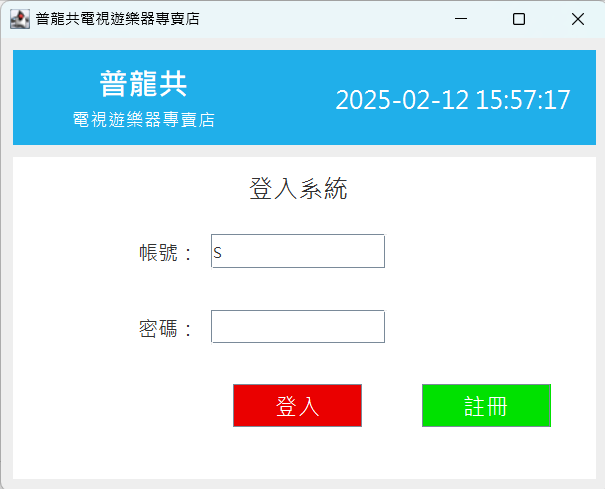
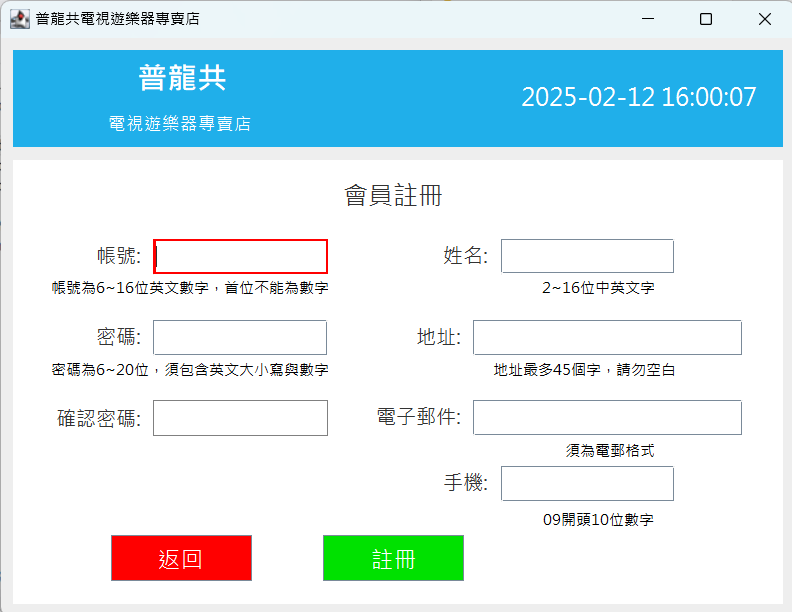
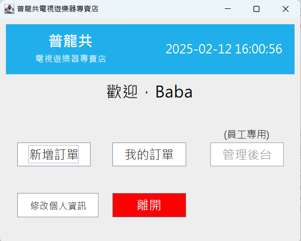
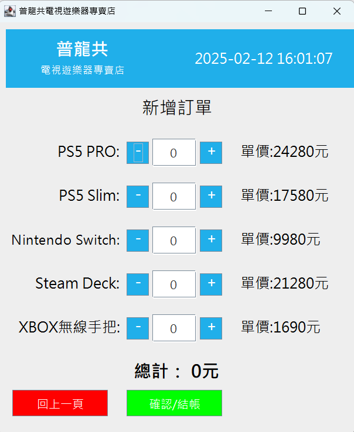
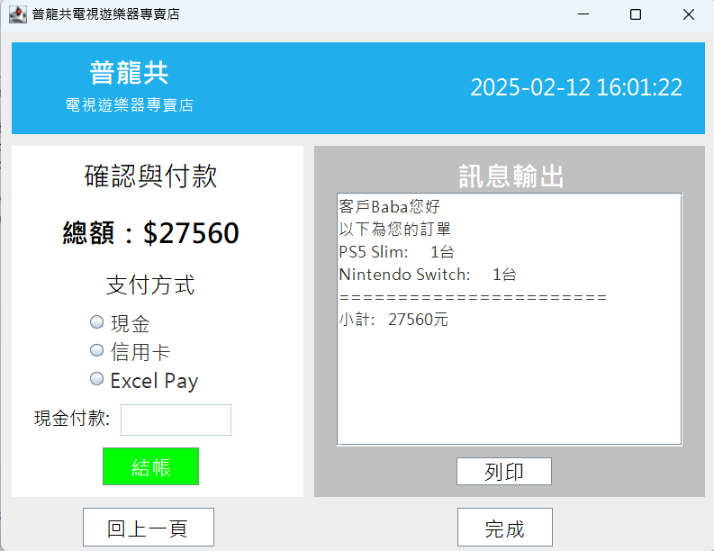
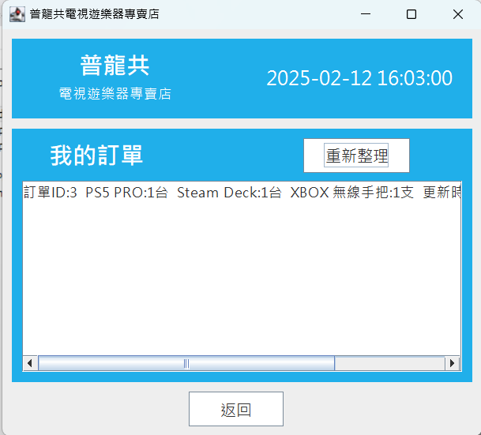
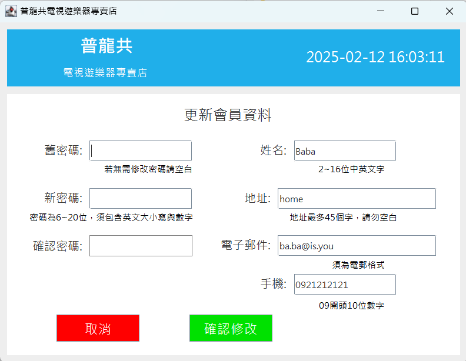
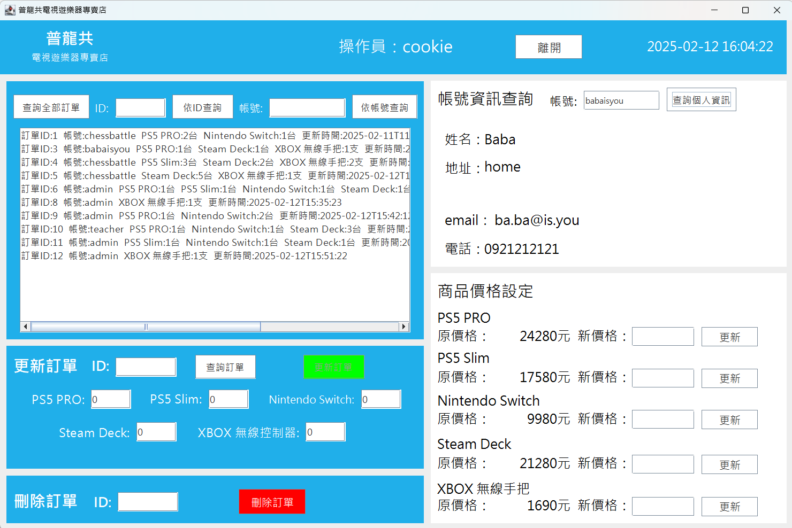

# javaOcp-20250207: 遊戲機商店系統
### 使用技術
- Java
- MySQL
#### 設計模式
- MVC
- dao pattern
# 使用方式
### 1. 下載所需檔案
本頁面右上方Code按鈕，選擇 Download ZIP 下載所有檔案
若無需原始碼可手動下載 HomeWork4.jar、db.txt、與db資料夾內檔案
### 2. 準備環境
- 確認電腦環境已安裝Java 11與MySQL
- 開啟MySQL Workbench並連接到MySQL伺服器
- 匯入`db`資料夾內的所有檔案，並確認是否出現`consoleshop`的Schema
### 3. 執行程式
- (Windows) 雙擊ConsoleShop.jar即可執行
- 或開啟終端，移動到ConsoleShop.jar所在資料夾，並輸入‵java -jar ConsoleShop.jar`
# 畫面展示
登入畫面

註冊畫面

主畫面

新增訂單

結帳畫面
- 現金:輸入支付的現金，結帳後會輸出找零
- 信用卡:結帳時需再輸入姓名確認
- Excel Pay:結帳時需選擇檔名為.xls或.xlsx的檔案，讀取成功則輸出獲得點數(每消費300元獲得1點)

查詢訂單畫面

修改個人資訊畫面

管理後臺畫面
- 需要使用員工帳號才能進入，預設員工帳密為admin/admin

